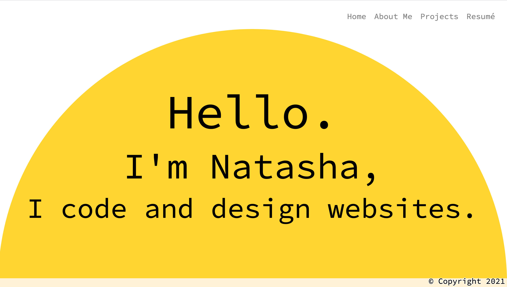

# Online-Portfolio2
A portfolio of my work so far. Created using React.js.

## Table of Contents
1. [ Description ](#desc)
1. [ Visuals ](#visuals)
1. [ Deployed Webpage ](#deployed)
1. [ Support ](#support)
1. [ Next Steps ](#next_steps)
1. [ Authors and Acknowledgement ](#acknowledge)
1. [ License ](#license)

## 1. Description
This is a portfolio of what I've done!

### Notes:
1. I got rid of the contact form because it seemed outdated.
1. The link to my resume currently does not work but I will fix this before I start applying to jobs.
1. This is otherwise pretty much the exact same as my non-react portfolio.

## 2. Visuals
Screenshot of the webpage.

## 3. Deployed Webpage
[The deployed site](https://tasha876.github.io/Online-Portfolio2), hosted by GitHub Pages.

## 4. Support
Should you find an issue with this webpage, please create a [new issue](https://github.com/Tasha876/Online-Portfolio2/issues/new/choose) on my GitHub repository.

## 5. Next steps
- Get link to resume to work.
- Maybe implement a sort of slideshow for my projects to take more advantage of reacts features

## 6. Authors and Acknowledgement
This site was created by Natasha Fray using [React](https://reactjs.org/) and [Bootstrap](https://getbootstrap.com/).

## 7. License
This project is covered by the [MIT](LICENSE) license.

